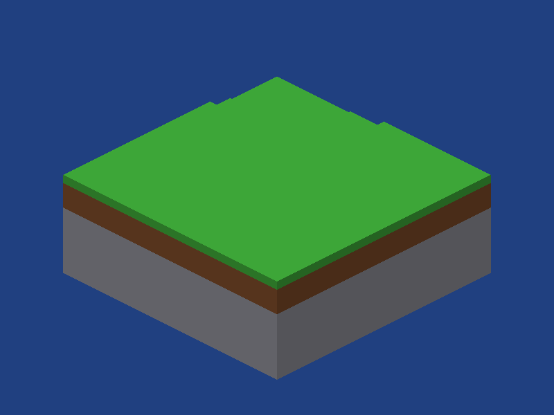

# VoxelA

VoxelA is a planned voxel sandbox game written in assembly. The goal is a massive, explorable world with blocks, entities, chunk rendering, reproducible procedural terrain, biomes, and both creative and survival modes.

This repository contains an assembly engine foundation and the remaining game plan. The default executable is a headless terrain-generation demonstration. The optional window executable now renders seeded voxel terrain with a controllable spectator camera and block editing; it is not yet a playable game. Implemented capabilities and build commands are listed below; unchecked roadmap items remain outstanding.


## Current implementation and build instructions

CPU engine implementation is NASM assembly; GPU shaders use GLSL. Python is used only for independent tests and framebuffer capture. The headless core has no SDL/OpenGL dependency. An optional graphics bootstrap uses SDL2 and OpenGL 3.3.

Implemented:

- Native System V and Microsoft x64 argument mapping, aligned call frames, and Windows unwind records for current non-leaf routines.
- Caller-owned bounded arenas with alignment, capacity/overflow checks, reset, and high-water tracking.
- SplitMix64 mixing, FNV-1a byte hashing, and overflow-checked decimal/hex seed parsing. Text-seed hashing exists as a primitive; a seed-entry UI does not.
- Signed section/local-coordinate mapping, index and world-bound checks, validated 16-bit block access, and initial solidity/opacity/breakability flags.
- Global fixed-point quintic 2D value noise, climate-based biome classification, and reproducible section generation.
- A bounded section cache with validated insertion, loaded/unloaded/out-of-bounds lookup, data revisions, and neighbor mesh invalidation on arrival and boundary edits.
- Neighbor-aware exposed-face extraction with opaque/cutout visibility rules, count queries, and capacity-checked output. CPU face records expand into counterclockwise colored triangles for GPU upload.
- An optional seeded terrain viewer with GLSL shaders, VAO/VBO upload, depth testing, an orthographic spectator camera, and a 2×2 surface-section grid. It currently uses block colors instead of textures.
- Assembly voxel DDA raycasting, screen-to-world orthographic rays, loaded-box clipping, a yellow block outline, and mouse editing with cache revisions and mesh rebuilds.
- A portable bounded-demo block-override snapshot codec with checksum/version validation and transactional loading, plus manual F5/F9 file persistence through assembly Linux/Windows adapters.
- Shared assembly camera state with elapsed-time movement, normalized diagonal speed, yaw wrapping, bounded zoom, reset, and drawable aspect updates.
- An optional SDL2 window and OpenGL 3.3 core context with resize-aware drawable dimensions, Escape/close handling, staged error cleanup, and a three-frame pixel-readback smoke check.

Generator **prototype v0** produces heights 64–79, bedrock, stone, surface dirt/grass or desert sand, and air. Forest and mountain biome IDs exist, but trees, caves, distinct mountain heights, blended biome profiles, and generator save/version compatibility are unfinished. This prototype must not be treated as the final version-1 world format.

On Linux install NASM 2.16+, GCC, GNU Make, binutils, and Python 3, then run:

```sh
make TARGET=linux CONFIG=debug all test reference abi-reference
./build/linux/debug/voxela
make TARGET=linux CONFIG=release all test reference abi-reference
```

On Windows, use an MSYS2 **UCRT64** shell and install `make`, `nasm`, and `mingw-w64-ucrt-x86_64-gcc` with MSYS2's package manager, then run:

```sh
make TARGET=windows CONFIG=debug all test
./build/windows/debug/voxela.exe
make TARGET=windows CONFIG=release all test
```

For Windows cross-linking on Linux with MinGW-w64 installed:

```sh
make TARGET=windows TOOLCHAIN_PREFIX=x86_64-w64-mingw32- all
make TARGET=windows TOOLCHAIN_PREFIX=x86_64-w64-mingw32- build/windows/debug/engine_tests.exe
```

Cross-linked executables require a Windows runtime to execute. `NASM=/path/to/nasm` and `LINKER=/path/to/gcc` can override tool locations. Outputs are separated by platform and debug/release configuration. Use `make clean` after changing toolchain or assembler options. `make objects TARGET=windows` checks COFF assembly without needing a linker.

`make test` runs 55 native assembly assertions and returns nonzero on failure. Passing any argument to the test executable deliberately exercises its failure-reporting path. Linux `make reference` checks 147,427 assertions against independent integer references and camera invariants, including all section cells, allocation errors, numeric overflow, negative coordinates, world limits, buffer canaries, and frozen section hashes. `make abi-reference` repeats that suite against Microsoft-ABI core code via a Linux adapter; it does not emulate Windows OS behavior. CI defines Linux and native Windows debug/release jobs; those remote jobs have not been observed running yet.

### Optional graphics bootstrap

Install SDL2 development libraries, then build and run:

```sh
make window
./build/linux/debug/voxela-window
./build/linux/debug/voxela-window --smoke
```

On Windows, install `mingw-w64-ucrt-x86_64-SDL2` in MSYS2 UCRT64, use `make TARGET=windows window`, and put the matching `SDL2.dll` beside the executable for standalone execution. Within UCRT64 its library directory is normally already on PATH. The optional target shares assembly source across platforms, but native Windows graphics execution remains unverified.

The window displays four adjacent generated surface sections, covering X/Z 0–31 and Y 64–79 for seed 42, using a controllable orthographic spectator camera. Neighbor faces are culled across the loaded section boundaries. This bounded terrain slab is a renderer demonstration, not a streamed world. WASD pans relative to camera yaw; Space/Left Ctrl changes height; Q/E turns; +/- changes zoom; Left Shift increases speed; R resets the view; Escape exits. Mouse hover highlights a block; left click removes it and right click places the selected block in the adjacent empty cell. Keys 1–6 select stone, dirt, grass, sand, log, and leaves. Placement requires a loaded empty cell; bedrock cannot be removed. F5 saves edits to `voxela-demo.vxa` in the current working directory; F9 loads that file into the regenerated demo. Saving and loading are manual: closing does not save, and startup does not automatically load. Save/load results appear in the console. Edits do not change generation. Movement and editing pause on focus loss. Resizing updates drawable aspect, and reset preserves that aspect. This is spectator movement without collision, not a creative/survival player controller. Texture mapping, mouse look, perspective projection, and gameplay are unfinished. Escape or closing the window exits normally. `--smoke` verifies three frames by reading a terrain pixel, rejecting the background color, and checking OpenGL errors; closing before validation or exceeding a five-second smoke deadline is a failure. On a Linux machine supporting SDL's offscreen driver, use `SDL_VIDEODRIVER=offscreen` for smoke validation. A driver without OpenGL 3.3 produces an initialization failure instead of a false success. Software-rendered smoke checks validate the pipeline, not hardware performance.

`tests/chunks.py` independently checks all 24,576 cell/face neighbor mappings, exact face records for isolated blocks, mixed materials and random sections, neighboring-section occlusion, canaries, invalid IDs, capacity failures, lookup statuses, revision overflow, and neighbor invalidation. It runs under both `reference` and `abi-reference`.

Mesh records are 8 bytes: unsigned local X/Y/Z and direction bytes at 0/1/2/3, little-endian uint16 block ID at 4, and zero uint16 reserved at 6. Records are emitted in cell index order, then direction order. Input and output buffers must not overlap, and callers must hold an immutable snapshot throughout counting and emission. Vertex expansion uses six CCW vertices per face, each containing float32 X/Y/Z/R/G/B (24 bytes), with directional face shading. Texture UVs, propagated lighting/AO, greedy merging, and index-buffer optimization are still future work.

`tests/vertices.py` independently verifies coordinates, all outward triangle normals, float32 colors, canaries, invalid records, origin limits, and capacity handling under both calling conventions. `faces_expand` limits one input batch to 24,576 faces and relative origins to ±1,048,576 blocks; the future camera must rebase distant world coordinates before expansion.

On Linux, `make graphics-reference` builds a test library and runs `tests/graphics.py` with the same SDL libraries. Run it with an available driver (offscreen or Xvfb). The test compares the full framebuffer to a background-only frame, verifies terrain coverage, repeats renderer initialization/drawing/shutdown, and checks identical images and idempotent cleanup. It also verifies that movement, rotation, zoom, and aspect changes affect drawing, invalid sizes preserve the image, and reset restores the original image. It intentionally compiles an invalid shader and requires rejection; its expected compiler diagnostic is not a failing test. An optional second argument to the test script writes a PNG capture from actual OpenGL readback. Shader source files are embedded at assembly time, so the current viewer has no external asset-path dependency. A shader compile/link failure prints its log and fails startup.



### Automated Windows executable downloads

Every push to `main` triggers `.github/workflows/build.yml`. Its Windows jobs build debug/release executables and run native headless engine checks. The release job packages the graphical viewer as **VoxelA.exe**, the headless demo as **VoxelA-headless.exe**, and all transitive non-system DLL imports. The package includes dependency notices, controls, the source commit, and SHA-256 file hashes. Missing DLLs, invalid PE architecture, missing notices, or failed builds/tests prevent successful packaging.

After a successful run, open [GitHub Actions](https://github.com/Notmoodo9/VoxelA/actions), select the latest **Assembly engine checks** run, and download **VoxelA-Windows-x64-<commit>** from Artifacts. Extract the whole download and run **VoxelA.exe** with the included DLLs beside it. Artifacts are retained for 14 days. Pull requests and manually started runs also build packages. This uses Actions artifacts, not GitHub Releases, and does not commit binaries into source control.

Windows graphics execution still needs native validation on a machine with OpenGL 3.3; the workflow builds that viewer but runs the headless engine checks. Local Linux graphics checks and Windows-ABI tests do not establish native Windows graphics behavior. An uploaded package can only be claimed once the corresponding Actions run succeeds.

`tools/package_windows.py` inspects PE imports recursively, handles import cycles and case-insensitive DLL names, treats Windows API-set imports as OS-provided, and stages a complete directory before publishing it. `tests/packaging.py` tests closure, missing dependencies, checksums, architecture parsing, failure cleanup, existing-output preservation, and notices using explicit fixture graphs. It does not emulate Windows loading.

`tests/camera.py` tests movement magnitude, diagonal normalization, opposing actions, clamped elapsed time, resize validation, yaw wrapping, zoom bounds, reset, and invalid input under both calling conventions. Camera yaw uses CRT sine/cosine functions through assembly calls; world-generation arithmetic remains integer-based and unaffected by camera floating-point state.

### Available core interfaces

Every function follows the selected native ABI and may clobber volatile registers and flags. Buffers must be valid and sufficiently large; index checks cannot validate a supplied pointer's allocation size. No function transfers ownership or synchronizes access between threads.

| Functions | Contract |
| --- | --- |
| `mix64(value)`, `fnv1a(bytes,length)` | Return a wrapping 64-bit hash; FNV accepts embedded NUL bytes |
| `seed_numeric(text,out)` | NUL-terminated decimal/hex input; returns 0 or -1 and preserves output on failure |
| `arena_init(arena,buffer,capacity)`, `arena_reset(arena)` | 32-byte arena layout: base/capacity/used/high-water at 0/8/16/24; reset invalidates allocated pointers |
| `arena_alloc(arena,size,alignment)` | Returns pointer or NULL; nonzero size, power-of-two alignment ≤4096; errors leave state unchanged |
| `floor_section(axis)`, `local_axis(axis)` | Signed floor division by 16 and nonnegative remainder |
| `block_index(x,y,z)`, `world_in_bounds(x,y,z)` | Index returns -1 on invalid local coordinates; bounds returns 0/1 |
| `section_get(buffer,index)`, `section_set(buffer,index,id)` | 8192-byte caller buffer; getter returns ID or -1; setter returns 0/-1; no dirty revisions yet |
| `block_flags(id)` | Bits: solid=1, opaque=2, breakable=4, cutout=8; invalid ID returns -1 |
| `lattice(seed,x,z)`, `fade_q16(t)`, `noise2(seed,x,z,shift)` | Noise returns 0..65535; shift 0..16 or -1; fade requires t in 0..65536 |
| `biome_at(seed,x,z)`, `terrain_height(seed,x,z)` | Prototype biome IDs plains=0, forest=1, desert=2, mountain=3; global height 64..79 |
| `cache_init(header,entries,capacity)`, `cache_insert(header,coords,blocks,token)` | Caller owns a 24-byte header, capacity × 64-byte entries, and block buffers; insertion returns entry pointer or NULL; nonzero lifetime tokens must be supplied uniquely by the caller |
| `cache_find(header,coords)`, `cache_get(header,world_coords,out)` | Find returns entry/NULL; get returns AVAILABLE=0, UNLOADED=1, OUT_OF_BOUNDS=2 and preserves output except on success |
| `cache_edit(header,entry,index,id)`, `cache_touch_neighbors(header,entry)` | Edit increments revision only on changes, rejects overflow, invalidates boundary neighbors; touch invalidates all face-sharing neighbors |
| `face_neighbor(index,direction)` | Directions -X/+X/-Y/+Y/-Z/+Z; returns local index or 4096 OR remapped neighbor index, invalid returns -1 |
| `mesh_build(section,neighbors,out,capacity)` | Six section pointers in direction order (NULL means absent); returns face count, -1 invalid IDs, -2 insufficient capacity; NULL output counts only |
| `camera_init(state)`, `camera_resize(state,width,height)`, `camera_step(state,mask,elapsed_ms)` | Caller owns 32-byte float state: pan XYZ/yaw/zoom/aspect/sin/cos; input masks documented in camera.asm; delta clamped to 100 ms, invalid bits/sizes rejected without changes |
| `faces_expand(records,count,target)` | Returns 6 × face count, -1 invalid records/origin, -2 capacity; target holds output pointer, vertex capacity, and signed int32 relative X/Y/Z origins at offsets 0/8/16/20/24 |
| `generate_section(buffer,seed,coords)` | coords is three signed int64 section axes X/Y/Z; writes all 4096 cells; invalid axes return -1 without writes |

For `lattice`, compute `mix64(seed XOR (x * 0xd6e8feb86659fd93) XOR (z * 0xa5a3564e27f8862f)) >> 48`, with modulo-2^64 arithmetic. Noise uses floor-divided global lattice positions and signed interpolation rounding toward negative infinity. Quintic multiplication rounds after each specified product; `tests/reference.py` defines an independent exact reference for prototype fixtures. Blocks use IDs air=0, stone=1, dirt=2, grass=3, sand=4, wood=5, leaves=6, bedrock=7.

Remaining first-playable work starts with a texture atlas, streaming lifecycle, and collision-aware player movement. The section cache currently has linear lookup and no eviction or asynchronous jobs. Demo edits can be saved and loaded; region/world persistence, entities, survival rules, UI, and audio are still unimplemented.

## Initial technical direction

- Support x86-64 Windows 10/11 and x86-64 Linux from the first playable milestone, using NASM syntax. Windows uses PE/COFF objects and the Microsoft x64 calling convention; Linux uses ELF objects and System V AMD64. ARM and 32-bit systems are outside the initial scope.
- Write game logic, world generation, rendering orchestration, and platform integration in assembly. Use system libraries and drivers through their native APIs; calling a library does not mean it is implemented in assembly. No C/C++ game implementation is planned.
- Use SDL2 for windows, input, audio, and an OpenGL context. Start with OpenGL 3.3 and build mesh buffers on the CPU in assembly. GPU shaders necessarily use the graphics API's shader language; this is an explicit exception to assembly-only source. An assembly-only software renderer would be a different rendering target.
- Use NASM, GNU Make, SDL2, and OpenGL 3.3. Use MinGW-w64 via MSYS2 UCRT64 for native Windows linking and GCC/binutils for Linux linking. The compiler driver links assembly objects and runtime libraries; it does not compile game logic in C. Select and document exact supported versions when the build is implemented.
- Begin as a single-player game. Multiplayer is outside the initial scope.

## World and data model

The world must be streamed, never allocated or generated in full. Aim for a horizontal world comparable to Minecraft's scale: approximately 60 million blocks across each horizontal axis, with a bounded initial vertical range of 256 blocks. Final limits must be checked against coordinate arithmetic, persistence, and rendering precision.

Use signed 64-bit world coordinates, 16 × 16 × 16 block sections, and floor division for chunk lookup, including negative positions. Keep rendering coordinates relative to the camera so distant terrain does not lose floating-point precision. Load nearby sections, retain a bounded cache, and unload distant sections.

Define a 64-bit base seed and a versioned generator. A world is identified by its seed, generation version, and generation settings. The same identity must generate identical unmodified blocks and biome assignments regardless of chunk loading order, worker scheduling, or previous random calls. Player edits and entity state are saved separately and reapplied after generation.

Use specified integer or fixed-point noise and coordinate hashing for generation. Derive independent random streams for terrain, biomes, caves, vegetation, and structures. Do not use a shared mutable random stream or platform-dependent floating-point noise for reproducible terrain. Features crossing chunk boundaries must have deterministic ownership and placement rules.

## Implementation roadmap

### 1. Build and platform foundation

- [x] Add an assembly source layout, Makefile, documented dependencies, and debug/release targets.
- [ ] Implement the program entry point and library calls with correct stack alignment, register preservation, and error handling.
- [ ] Add memory allocation, logging, timing, file access, and reusable integer/math routines.
- [ ] Open a window and graphics context; handle input, resizing, focus changes, and clean shutdown.
- [ ] Add a fixed-step simulation loop with independent rendering and frame pacing.
- [x] Add an assembly test runner with failures reported through a nonzero exit status.

Completion check: a clean checkout builds and runs a window, reports initialization failures, and exits without leaked application resources.

### 2. Blocks and chunk storage

- [ ] Define stable block IDs and properties: solid, opaque, breakable, hardness, texture, and collision behavior.
- [ ] Add air, stone, dirt, grass, sand, wood, and leaves as initial blocks.
- [ ] Implement section allocation, block indexing, world-coordinate lookup, and neighboring-section queries.
- [ ] Define ownership and lifetime rules for loaded sections, meshes, and generation jobs.
- [ ] Track separate dirty states for meshes and persisted edits.
- [x] Test block access at section boundaries, negative coordinates, and world limits.

Completion check: blocks can be read and changed accurately across adjacent sections without corrupting memory.

### 3. Chunk rendering and interaction

- [x] Implement an orthographic spectator camera, projection, depth testing, and colored opaque block rendering.
- [ ] Add a texture atlas and textured block rendering.
- [ ] Build meshes containing only exposed faces; update adjoining meshes after boundary edits.
- [ ] Upload and release vertex/index buffers safely; keep graphics API operations on the context-owning thread.
- [ ] Add view-distance limits and frustum culling.
- [x] Implement voxel raycasting, block highlighting, placement, and removal in the bounded viewer.
- [ ] Separate transparent/cutout rendering from opaque meshes when those blocks are added.
- [ ] Add greedy meshing or equivalent mesh reduction after the basic path is correct.

Completion check: multiple adjacent chunks render correctly, hidden faces are omitted, and edits update visible geometry and selection.

### 4. Deterministic world generation and biomes

- [ ] Specify and test seed parsing, coordinate hashing, pseudorandom generators, and noise arithmetic.
- [ ] Generate terrain height, surface layers, caves, and bedrock from the base seed.
- [ ] Generate temperature and moisture fields with coherent biome transitions.
- [ ] Add plains, forest, desert, and mountain biomes with distinct terrain, surface blocks, and vegetation.
- [ ] Place trees and other features consistently across chunk boundaries.
- [ ] Record the generator version and settings in world metadata; retain compatibility or explicitly reject unsupported versions.
- [ ] Add golden block/biome hashes for known seeds and coordinates.
- [ ] Test generation in different orders and at negative and distant coordinates.

Completion check: identical world identities produce identical chunk hashes across repeated runs and different generation orders; neighboring chunks have no generation seams.

### 5. Massive-world streaming and persistence

- [ ] Prioritize generation and meshing near the player with bounded queues and memory budgets.
- [ ] Start with budgeted single-threaded work, then add workers with explicit synchronization and cancellation.
- [ ] Unload distant chunks safely and invalidate stale mesh jobs.
- [ ] Implement camera-relative rendering and accurate movement at distant coordinates.
- [ ] Define a versioned region/save format for metadata, block edits, player state, and persistent entities.
- [x] Validate file lengths and identifiers, replace a single demo save atomically, and reject corrupt demo snapshots. Region/world persistence remains outstanding.
- [ ] Save on explicit request and orderly exit; document recovery behavior after interruption.
- [ ] Measure traversal, generation latency, mesh upload cost, and resident memory at configurable view distances.

Completion check: long-distance travel keeps memory bounded, edited worlds survive reloads, and far-away chunks reproduce their original terrain.

### 6. Player physics and entities

- [ ] Define stable entity IDs, position, velocity, bounds, type, health, and lifecycle rules.
- [ ] Implement player movement, gravity, jumping, and collision against solid blocks.
- [ ] Use a spatial index for nearby entity queries and collision candidates.
- [ ] Add dropped items and at least one simple creature with spawning, movement, and basic behavior.
- [ ] Define entity behavior at unloaded chunk boundaries and persistence rules.
- [ ] Test high-speed movement, corner collisions, entity removal, and save/reload identity.

Completion check: the player and entities interact with terrain reliably, and persistent entities restore without duplication.

### 7. Creative mode

- [ ] Add world creation with seed entry and explicit creative-mode selection.
- [ ] Add flying, adjustable movement speed, unlimited block selection, and instant breaking.
- [ ] Prevent health, hunger, and resource consumption from restricting creative play.
- [ ] Add a hotbar, inventory/block picker, pause screen, and mode indicator.
- [ ] Save the selected mode and creative player state.

Completion check: a player can create a seeded world, fly, build freely, and resume the same world after restarting.

### 8. Survival mode

- [ ] Add survival-mode world creation and a safe deterministic spawn search.
- [ ] Add health, damage, death, and respawn.
- [ ] Add finite inventory stacks, item drops, block-breaking time, and tool requirements.
- [ ] Define an initial crafting/progression loop, recipes, and tool durability.
- [ ] Add hunger, food, and regeneration rules.
- [ ] Add day/night progression and at least one hostile entity with basic behavior.
- [ ] Persist inventory, health, hunger, progression, time, and respawn state.
- [ ] Specify mode-switching rules and verify survival resource constraints.

Completion check: a player can gather resources, craft a tool, take damage, eat, die, respawn, and continue after a save/reload.

### 9. Integration, performance, and release readiness

- [ ] Automate build and headless assembly tests in CI; add graphics smoke tests where a suitable context is available.
- [ ] Test chunk boundaries, seed reproducibility, save corruption handling, and both game modes together.
- [ ] Stress rapid movement, repeated edits, chunk unloading, and generation cancellation.
- [ ] Profile representative hardware and record a frame-time and memory budget before claiming performance targets.
- [ ] Add settings for view distance, input, sound, and display behavior.
- [ ] Document controls, build/run commands, save locations, known limitations, and supported hardware.
- [ ] Package a playable build with correctly licensed assets and dependency notices.

Completion check: a fresh environment can build and run the game using documented commands, and both modes pass reproducibility, gameplay, and persistence checks.

## First playable milestone

Implement stages 1–4 with a small streamed view: open a window, render seeded terrain across multiple chunks, move a camera, and place/remove blocks. Verify seed reproducibility before expanding streaming and save support. Complete creative mode next, then survival mechanics on the same world and entity systems.

## Development rules

- Keep game implementation in assembly within the stated platform and shader exceptions.
- Define binary formats, calling conventions, ownership, and arithmetic behavior before dependent systems are implemented.
- Make generation reproducibility a tested contract rather than a visual assumption.
- Keep world memory proportional to loaded chunks, not total world size.
- Update this roadmap as work is implemented, and mark tasks complete only after their completion checks pass.

## Detailed engine specification

The following contracts are implementation requirements. Numeric gameplay values are initial tuning defaults; generator constants and serialized identifiers become compatibility commitments when a generation/save version is released. The detailed contracts below describe the full target engine. Only APIs and commands explicitly listed in the current implementation section are available.

### A. Source boundaries and assembly ABI

Proposed source directories:

| Directory | Responsibility |
| --- | --- |
| `src/core/` | Allocators, arrays, hash maps, logging, math, hashing, serialization |
| `src/platform/` | Entry points, OS-specific file operations, external-call adapters |
| `src/world/` | Block registry, section storage, generation, streaming, lighting, saves |
| `src/render/` | OpenGL loader, camera, mesh builder, uploads, terrain/entity/UI passes |
| `src/game/` | Simulation, player, entities, inventory, crafting, game modes |
| `src/ui/` | Menus, text, HUD, settings, input capture |
| `src/audio/` | Sound resources, mixing, playback commands |
| `include/` | NASM constants, structure offsets, function and ABI macros |
| `assets/` | Textures, GLSL shaders, fonts, sounds, notices |
| `tests/` | Assembly unit tests, golden fixtures, integration scenarios |

- [ ] Give every public routine documented inputs, outputs, clobbered registers, ownership, and error results. Never rely on undocumented flags surviving a call.
- [ ] Use the native platform ABI for shared assembly functions through macros that map argument registers and stack arguments. Linux arguments begin in RDI/RSI/RDX/RCX/R8/R9; Windows begins in RCX/RDX/R8/R9 and requires 32 bytes of caller-provided shadow space. Floating-point arguments need their own ABI mapping.
- [ ] Maintain required 16-byte stack alignment at call sites and preserve each ABI's nonvolatile registers, including Windows XMM6–XMM15 when used. Do not use the Linux red zone in shared code.
- [ ] Define structure offsets centrally with NASM structures and assert sizes. Keep native pointers out of save formats.
- [ ] Keep gameplay and world modules independent of OS handles. Route OS operations through platform adapters and SDL calls through ABI-correct wrappers.
- [ ] Provide Windows unwind information for non-leaf routines that modify the stack or saved registers, using an assembler-supported metadata strategy verified by the linker and debugger.

### B. Windows and Linux build/runtime contract

- [ ] Produce `build/linux/voxela` from `nasm -f elf64` objects and `build/windows/voxela.exe` from `nasm -f win64` objects. Separate object directories and platform defines prevent incompatible cache reuse.
- [ ] Implement `make TARGET=linux CONFIG=debug`, `make TARGET=windows CONFIG=debug`, release variants, and matching test targets. Add a toolchain prefix option for Linux-to-Windows cross-linking. These commands become documented build instructions only after they work.
- [ ] On Windows, provide a normal executable entry via the selected runtime, place the matching 64-bit SDL2 DLL beside the executable, and load OpenGL functions through `SDL_GL_GetProcAddress`. Do not assume modern OpenGL exports exist in `opengl32.dll`.
- [ ] On both platforms, request a 3.3 core context and verify the actual version and every required function pointer. If the driver cannot support it, display an actionable startup error. Windows needs a working vendor graphics driver with OpenGL 3.3 support.
- [ ] Resolve assets from the executable/base directory, not the working directory. Store user saves/settings under SDL's per-user preference directory; convert paths correctly in Windows platform adapters. Do not write saves beside an executable installed in a protected directory.
- [ ] Build Linux and Windows in CI, run headless engine tests natively on each, and compare generation fixtures between them. Cross-compilation and Wine are supplemental checks; a native Windows graphics/gameplay run is required before claiming Windows runtime support.
- [ ] Package assets, SDL DLLs where needed, dependency licenses, and controls. Test launching from a directory containing spaces and non-ASCII characters.

Windows PE executables cross-link successfully, and the core has been tested through its Windows calling convention on Linux. Native Windows execution and graphics remain unverified locally; the CI workflow includes native Windows engine checks.

### C. Startup, shutdown, and simulation order

- [ ] Initialize logging, allocators, settings, SDL, window/context, GL functions, asset registries, renderer, audio, and menus in that order. Track successful stages so a failure unwinds only initialized resources.
- [ ] Use a monotonic timer and a 20 Hz simulation step (`dt = 0.05 seconds`). Accumulate elapsed time, clamp a single elapsed sample to 0.25 seconds, and allow at most five simulation steps per rendered frame. Record discarded backlog instead of entering an endless catch-up loop.
- [ ] Per frame: collect events, update UI/input intent, run simulation steps, accept completed jobs, upload meshes within a time/byte budget, render, and present. Interpolate visual transforms between simulation states without interpolating authoritative blocks or inventory.
- [ ] Per simulation step: consume player commands; apply permitted edits; update player/entity physics; update AI, combat, hunger, and time; process lighting changes; update streaming demand; queue bounded generation/mesh/save work.
- [ ] Pause single-player simulation in the pause menu. Clear held actions on focus loss and release relative mouse capture. Resume without a large elapsed-time jump.
- [ ] Shutdown by stopping new jobs, joining workers, finishing or reporting failed saves, freeing GL resources on the render thread, stopping audio, and releasing remaining resources.

### D. Memory and ownership

- [ ] Use a general heap for persistent objects, arenas for generation/mesh jobs, and a resettable frame arena for temporary UI/render data. Record allocation sizes and high-water marks in debug builds.
- [ ] A world section owns its blocks and light arrays; the renderer owns GPU buffers; a worker owns its immutable input snapshot and output until the main thread accepts it. Never expose live mutable block arrays to workers.
- [ ] Use bounded hash maps keyed by full section coordinates. Check arithmetic overflow before buffer allocation and file offset computation.
- [ ] Account for at least 8 KiB of block IDs per section (`4096 × uint16`) plus light arrays, metadata, snapshots, and CPU/GPU meshes. Budget all categories, rather than counting only blocks.
- [ ] Start with a 512 MiB CPU world/job budget, a separate 256 MiB mesh/GPU budget, and configurable limits. Reduce loading distance or defer work when limits are reached; never discard unsaved edits to satisfy a budget.

### E. Block registry and addressing

- [ ] Reserve block ID 0 for air. Store a 16-bit ID for each block; keep properties in an immutable registry containing collision shape, opacity, light emission, hardness, drop item, required tool, and six face materials.
- [ ] Treat opacity, solidity, and render class independently: leaves may collide but use cutout rendering; air neither collides nor renders. Initial collision shapes are full cubes or empty.
- [ ] Number cells with `index = local_x + 16 * (local_z + 16 * local_y)`. Define Y as vertical and X/Z as horizontal everywhere.
- [ ] Compute section coordinate `floor(world_axis / 16)` and local coordinate `world_axis - section_axis * 16`. Example: world X = -1 maps to section X = -1 and local X = 15.
- [ ] Use initial block bounds X/Z in `[-30000000, 30000000)` and Y in `[0, 256)`. Outside the bounds, reject edits and enforce a movement boundary; do not wrap coordinates.
- [ ] Return distinct `AVAILABLE`, `UNLOADED`, and `OUT_OF_BOUNDS` results from block lookup. Unloaded terrain is not air: stop movement/interaction at unavailable sections and request loading.
- [ ] Centralize edits in `world_set_block`: validate the request, update block revision and persistence revision, invalidate the mesh, invalidate face-sharing neighbors at boundaries, and enqueue light updates.

### F. Seed, noise, terrain, and biome algorithm

- [ ] Accept unsigned decimal or `0x` hexadecimal seeds fitting 64 bits. Hash UTF-8 text seeds with specified FNV-1a 64-bit bytes and show the resulting numeric seed. Reject overflow; generate and display a random base seed only when the seed field is empty.
- [ ] Implement a published, fixed SplitMix64 mixer with wrapping unsigned arithmetic. Define and freeze how seed, signed coordinates encoded as two's-complement 64-bit values, and subsystem tags are combined. Include exact constants and golden vectors before generation version 1 is released.
- [ ] Implement lattice value noise with Q16.16 values, explicit signed rounding rules, quintic interpolation, and wide intermediates. Hash global lattice coordinates, then interpolate; never seed noise independently per chunk. Test overflow at world edges.
- [ ] Sample low-frequency global temperature/moisture fields at an initial 2048-block wavelength. Normalize to `[0,1]` fixed point. Start with desert for temperature ≥ 0.65 and moisture < 0.35, forest for moisture ≥ 0.55, and plains otherwise; select mountain terrain using a separate elevation field ≥ 0.75. Freeze these thresholds with the generator version.
- [ ] Blend terrain profiles continuously using climate/elevation weights even when the block-surface biome classification is discrete. Initial profiles: plains base 70/amplitude 8, forest 74/12, desert 68/10, mountain 100/55. Combine fixed octave wavelengths/amplitudes and clamp surface height to 8–240.
- [ ] Generate in order: climate and height; bedrock at Y=0; stone below the surface layer; biome-specific dirt/grass or sand; global 3D noise caves below the surface; deterministic vegetation. Water, rivers, fluids, and structures beyond trees are later features with separate tasks, not assumed complete.
- [ ] Place trees from a hashed 8×8 global candidate grid with biome-dependent eligibility. Give each candidate a reproducible position, height, and block pattern. Evaluate candidates in a bounded halo around each section and write only intersecting cells. Resolve overlapping placements by a stable candidate key and block priority, never by generation order.
- [ ] Freeze octave tables, cave thresholds, biome IDs, tree rules, and hash constants in a versioned generator definition. Hash blocks in canonical little-endian order and biome IDs in a specified column order for golden tests on both operating systems.

### G. Chunk lifecycle and worker scheduling

- [ ] Track section states `ABSENT → QUEUED → GENERATING → BLOCKS_READY → MESHING → UPLOAD_PENDING → RESIDENT`, with explicit failure and eviction paths. Track data, lighting, mesh, and save revisions separately from lifecycle state.
- [ ] Initially load columns within eight sections horizontally, including their bounded vertical sections. Retain an extra two-section hysteresis band to avoid repeated unloading at the edge. Change defaults after profiling.
- [ ] Prioritize the player's collision neighborhood, then nearest visible terrain, then other nearby sections. Use bounded queues and at most `max(1, min(4, logical_CPU_count - 1))` workers after the single-thread path passes tests.
- [ ] Job inputs include world identity, section coordinate, lifetime token, and data/light revisions. Discard completed outputs if any token or revision no longer matches. A new allocation at the same coordinate must receive a new lifetime token.
- [ ] Mesh jobs use a section snapshot and six face-neighbor snapshots or border samples. Missing neighbors may temporarily expose faces, but neighbor arrival/removal must invalidate those meshes. Physics still treats missing terrain as unavailable.
- [ ] Eviction waits for dirty data to be safely saved. Mark outstanding jobs obsolete and delete GL buffers only on the owning thread. Apply backpressure if saving fails rather than losing edits.

### H. Meshing, graphics, and lighting

- [ ] For each non-air block, inspect six neighbors. Emit a face when its material rules make it visible. Use consistent outward winding, normals, UVs, and index order. A fully enclosed opaque section should emit zero internal faces.
- [ ] Define packed vertices with local position, face normal/material, UV, light, and ambient-occlusion fields. Document exact offsets and matching GL attribute formats. Use 32-bit mesh indices unless a validated split guarantees smaller ranges.
- [ ] Keep opaque, cutout, and translucent meshes separate. Draw opaque and cutout geometry with depth writes; draw translucent geometry after them with blending and defined sorting limitations. The initial block set needs opaque/cutout paths; translucent fluids remain optional.
- [ ] Greedy-merge faces only when material, orientation, light, and AO attributes match. Preserve texture tiling using an explicit shader/atlas scheme rather than stretching one tile across a merged rectangle.
- [ ] Store player position as integer section coordinates plus bounded double-precision local offsets. Normalize after movement. Subtract nearby integer origins before conversion to render floats, and compute view/projection matrices in a documented handedness.
- [ ] Frustum-test section bounds before drawing. Start with a 0.05-block near plane and a far plane based on view distance. Do not add occlusion culling until correctness and profiling justify it.
- [ ] Store skylight and emitted light as two 4-bit levels per voxel. Seed open-sky columns, propagate light through permitted blocks, and process removal before repropagation after edits. Queue cross-section propagation until neighbors load and invalidate meshes when light changes.
- [ ] Add per-face ambient occlusion from neighboring occupancy. Apply day/night brightness to skylight at render time, leaving emitted light independent. Bound lighting work per tick and expose pending work for debugging.
- [ ] Validate mesh counts, winding, neighbor arrival, boundary edits, light removal, and GPU resource release with targeted fixtures and graphics captures.

### I. Player movement and block interaction

- [ ] Use an upright player AABB, initially 0.6 blocks wide and 1.8 high, with eye height 1.62. Movement defaults are walking at 4.3 blocks/second, gravity 24 blocks/second², and a jump velocity selected for about 1.25 blocks of height.
- [ ] Query solid voxel candidates covering the swept player bounds and resolve swept AABB collisions iteratively with a fixed iteration cap. Set grounded state from downward contact; test tunneling, edges, ceilings, and large velocities.
- [ ] Convert mouse motion to yaw/pitch, clamp pitch below ±90°, and normalize diagonal movement. UI capture prevents gameplay actions while typing or using menus.
- [ ] Use grid DDA ray traversal with a five-block reach. Return hit cell, entry face, distance, and previous empty cell; define axis-tie ordering and handle rays starting inside a solid block.
- [ ] Break the hit block and place into the face-adjacent empty cell. Validate loaded state, range, inventory, world bounds, and entity overlap before committing an edit. Use one transaction to change inventory and terrain together.
- [ ] Recompute survival break progress from target, held tool, hardness, and elapsed simulation ticks; reset on target/tool changes or interrupted input. Creative breaks immediately.

### J. Entities, AI, and combat

- [ ] Use runtime entity handles with slot index and generation counter to reject stale references; use separate persistent 64-bit IDs in saves. Store transforms, velocity, AABB, health, type, and type-specific state in documented arrays/pools.
- [ ] Maintain section-based spatial buckets after movement. Query neighboring buckets for collisions, pickups, attacks, and AI; do not scan every entity each tick.
- [ ] Model dropped items as gravity-affected entities containing item ID/count, pickup delay, and despawn timer. Merge compatible nearby stacks within stack limits and persist remaining timers.
- [ ] Start a passive creature with `IDLE/WANDER/FLEE` states and a hostile creature with `IDLE/CHASE/ATTACK` states. Use bounded local navigation and obstacle probes initially; define stuck recovery and defer long-distance pathfinding.
- [ ] Tick active entities near the player; serialize and suspend others with their owning region. Transfer ownership when they cross region boundaries. Reconcile transfers during save recovery to prevent duplicate IDs.
- [ ] Use a separately persisted simulation random stream for dynamic spawns and AI. Terrain reproducibility does not imply that player-dependent entity histories are identical.
- [ ] Spawn only in loaded valid terrain outside the immediate player neighborhood, with explicit per-type density limits. Combat applies range/visibility checks, a cooldown, damage, and knockback once per accepted attack.

### K. Items, creative, and survival rules

- [ ] Keep item IDs separate from block IDs. Define maximum stack size, associated placeable block, food value, tool class/tier, durability, and recipe use in immutable registries.
- [ ] Start with a nine-slot hotbar and 27 storage slots. Inventory insertion merges compatible stacks then uses empty slots, returning leftovers. Cursor-held UI stacks must be returned or saved safely when menus close.
- [ ] Creative enables flight, unlimited placement, a searchable block picker, instant breaking, and immunity to hunger/damage. Collision remains enabled by default; noclip is a separate optional debug capability.
- [ ] Survival uses finite stacks, tool-sensitive block drops, 20 health points, and 20 hunger points. Specify exhaustion costs, food recovery, starvation intervals, and regeneration conditions in one rules table before implementation; all changes run on simulation ticks.
- [ ] Begin progression with logs → planks → sticks/crafting table → wooden pickaxe → stone tools. Add a 2×2 inventory crafting grid and 3×3 table grid with exact shaped/shapeless recipes. Consume ingredients and produce output atomically only when output capacity is available.
- [ ] Track tool durability on successful applicable actions. Define fall damage from accumulated downward travel beyond a safe threshold and ensure creative bypasses it.
- [ ] Advance an initial 20-minute day/night cycle using saved simulation ticks. On death, drop survival inventory once, stop player interaction, display respawn UI, and restore health at a saved safe spawn. Never duplicate drops after reload.
- [ ] Store mode per world. Permit switching only through an explicit world setting, retain inventory/state, and record that survival has been switched to creative so progression status is honest.
- [ ] Find initial spawn by a bounded deterministic outward search for supported ground with sufficient clearance. Load/generate candidate terrain as needed; show a failure if no safe location is found within the search budget.

### L. Save format, recovery, and compatibility

- [ ] Use little-endian portable records with magic bytes, format version, record type, length, checksum, and validated limits. Specify each field width; never serialize native structures, padding, pointers, or OS handles.
- [ ] Store world seed, generator version/settings, stable registry version, mode, spawn, time, player/inventory state, and dynamic RNG state in metadata. Store only block overrides against generated terrain, including edits to air, plus persistent entities in region records.
- [ ] Group 32×32 horizontal chunk columns into a region. Map negative coordinates with floor division. Keep explicit offsets/lengths for section records and reject overlapping/out-of-file ranges.
- [ ] Snapshot data with a save revision; write a temporary file in the destination directory, flush data through the platform's durable-file adapter, then atomically replace it and retain a recoverable prior generation. Flush directory metadata where supported on Linux; document and test Windows replacement semantics.
- [ ] Commit a save generation through a manifest written last, so metadata and multiple regions can be recovered as a consistent set. Do not assume independently renamed files form one atomic world save.
- [ ] Clear dirty state only if the successfully saved revision still equals the live revision. Surface disk-full/access failures and keep unsaved state in memory.
- [ ] On startup, validate the manifest and referenced records, choose the latest complete generation, and report corruption without silently overwriting it. Support explicit migrations or reject incompatible versions with an explanation.
- [ ] Lock a world against simultaneous writers. Test interruption at each commit stage and cross-platform transfer of the same save.

### M. UI, assets, sound, and diagnostics

- [ ] Implement title, world list, create-world seed/mode settings, loading, pause, settings, and death screens as explicit states. Route errors to a readable message and log.
- [ ] Render HUD elements through a separate 2D pass: crosshair, selected block, hotbar, health/hunger, and break progress. Use a licensed bitmap font initially.
- [ ] Define action bindings independent of physical keys; show defaults and support rebinding. Offer mouse sensitivity, fullscreen/windowed mode, vsync, volume, and view distance, with validated settings and safe fallback defaults.
- [ ] Load texture/font/sound assets with error checks and fallback visuals where safe. Asset decoding may use approved libraries through assembly wrappers; document every dependency and its license.
- [ ] Mix/play UI, footsteps, placement, breaking, and damage sounds through SDL audio. The audio callback must not allocate, block on files, or access mutable gameplay structures; consume a bounded command queue and immutable sound buffers.
- [ ] Add a debug overlay with frame/tick times, section counts, queue depths, CPU/GPU memory estimates, current coordinates, seed/version, and save status. Log dropped work and failures without flooding each frame.

### N. Test matrix and implementation gates

| Area | Required evidence |
| --- | --- |
| ABI/platform | Native Linux and Windows calls, stack/register preservation, failure cleanup |
| Coordinates/storage | Negative boundaries, edge limits, lookup states, block-ID validation |
| Generation | Known hash/noise vectors; identical terrain fixtures on Linux and Windows; ordering independence |
| Streaming | Bounded memory, stale-job rejection, neighbor arrival, dirty-section eviction failure |
| Rendering/lighting | Expected face counts, seam edits, light removal, native graphics smoke runs |
| Physics/entities | Swept collisions, unavailable chunks, stale handles, entity transfer without duplication |
| Game modes | Creative freedom; survival consumption, crafting, damage, death, and reload behavior |
| Persistence | Round trip, corrupt/truncated files, interrupted commits, cross-platform saves |

- [ ] Build a headless engine test executable without requiring a graphics context. Failed assertions and zero selected tests must fail the runner.
- [ ] Record deterministic fixture generation/version and compare against checked-in expectations, never regenerate expectations automatically during a failing test run.
- [ ] Add a native Windows acceptance scenario: launch packaged game, create a seeded world, traverse chunk boundaries, edit blocks, exercise both modes, save/relaunch, and verify edits/state. Repeat on Linux and compare seed fixtures.
- [ ] Keep every earlier roadmap completion check as a gate. Finish platform/build contracts before shared modules; storage and deterministic generation before streaming; editing transactions and persistence before claiming mode completion.

The first playable milestone must build and run on both Windows and Linux. It may use a bounded synchronous chunk-loading path initially, but must render several chunks, demonstrate repeatable seeded biomes, move a collision-aware player, and allow creative block edits. Survival, asynchronous streaming, durable saves, full lighting, and optimization remain subsequent gates.

### Block interaction contracts

`world_raycast(cache,ray,hit)` traverses loaded voxels with a normalized double-precision ray, floor coordinates, and X/Y/Z tie order. Ray56 contains origin XYZ, direction XYZ, and reach (seven doubles). Reach is bounded to 256 blocks. Hit72 contains cell XYZ, entry face (6 when starting inside), distance, previous cell XYZ, and block ID. Returns 1 hit, 0 miss, 2 unloaded, 3 out of bounds, or -1 invalid; only a hit writes output. `ray_box_interval` clips against six double bounds. `camera_ray` uses logical window pixel centers and the same orthographic basis as the shader.

The viewer clips picking to X/Z [0,32) and Y [64,80), then builds twelve slightly expanded outline edges. `terrain_apply_edit` removes or places through the cache; actual edits increment revisions and mark boundary neighbors dirty. The next draw rebuilds all four section meshes and uploads their combined VBO. This synchronous bounded rebuild is a prototype, not the planned streaming worker system. `terrain_edit_cell` is an explicit loaded-cell adapter for tests; it rejects IDs above 6 and returns 1 changed, 0 unchanged/unloaded, or -1 invalid. No inventory, collision, or survival rules are implemented yet. Demo save/load is documented below.

`tests/raycast.py` exercises 10,680 assertions per ABI, including randomized independent traversal, negative coordinates, ties, bounds, invalid floats, output preservation, box clipping, and camera rays. Graphics tests verify selection outlines, removal/placement readback, restored meshes, unloaded-cell rejection, and edit retention across camera reset.

### Manual demo persistence

F5 writes `voxela-demo.vxa` relative to the process working directory, replacing the previous demo save only after the new temporary file has been completely written and flushed. F9 explicitly loads it. Loading replaces all four sections with the regenerated baseline plus the saved overrides; edits absent from the file are undone. Camera position and selected material are not serialized. This format is restricted to seed 42, generator prototype 0, registry 1, and the existing 2×2 section grid at Y=4. Changing those generation contracts requires a new format or migration. It is not the planned region format or a world selector.

The portable little-endian format has a 64-byte header followed by 0–16,384 eight-byte records:

| Offset | Width | Field and validation |
| --- | --- | --- |
| 0 | 8 bytes | Magic `VXADEMO` followed by a zero byte |
| 8, 12, 16 | uint32 each | Format 1, generator 0, registry 1; incompatible values rejected |
| 20 | uint32 | Override count, at most 16,384 |
| 24 | uint64 | Seed 42 |
| 32 | uint64 | Payload byte length, exactly count × 8 |
| 40 | uint64 | FNV-1a of the complete payload; corruption check, not authentication |
| 48, 56 | uint64 each | Reserved, both zero |
| 64 onward | 8 bytes each | uint16 section ordinal, local cell index, block ID, reserved zero |

Section ordinal is `sectionZ * 2 + sectionX` (0–3); local index is `localY * 256 + localZ * 16 + localX` (0–4095). Records must be strictly ordered by section/index with no duplicates, redundant overrides, unregistered blocks, or bedrock modifications. Block ID 0 explicitly records removal to air. Maximum file size is 131,136 bytes. A save with no overrides is 64 bytes.

`snapshot_encode(current,baseline,out,capacity)` validates both complete 32,768-byte section arrays before writing. It returns byte length, -1 invalid, or -2 insufficient capacity, preserving output on failure. `snapshot_decode(bytes,length,baseline,out)` validates the complete header, exact file length, checksum, baseline, and every record before touching output; it returns 0 or -1. Inputs and outputs must be disjoint. The renderer decodes into staging storage, checks revision overflow, and commits all changed sections together on its single owning thread. Only changed sections gain a data revision; all four meshes are invalidated and rebuilt on the next draw. Failed loads preserve blocks, revisions, selection, and meshes. Successful saves/loads update saved revisions; failed saves leave edits dirty.

`file_save(path,bytes,length)` creates `path.tmp` exclusively in the same directory. An existing temporary file is preserved and causes an error, preventing another writer or an interrupted save from being silently overwritten. On Linux it handles short writes and interrupted writes, flushes the file with `fsync`, closes it, renames it, and syncs the parent directory. On Windows it uses `CreateFileA(CREATE_NEW)`, bounded `WriteFile`, `FlushFileBuffers`, and `MoveFileExA(REPLACE_EXISTING | WRITE_THROUGH)`. Failures before replacement preserve the previous save and clean up only the temporary file owned by this operation. Return 0 means success; -1 means failure before replacement; Linux -2 means replacement succeeded but parent-directory sync failed, so durability is uncertain and edits remain dirty. Paths must contain 1–959 bytes. Windows currently uses ANSI file paths; full Unicode paths and network-filesystem durability are not validated. No retained backup generation, world-wide writer lock, autosave, recovery manifest, or multi-region transaction exists yet. An interrupted write may leave `.tmp`; inspect/move it before retrying rather than overwriting it automatically.

`file_load(path,out,capacity)` performs a bounded read and checks for trailing bytes beyond capacity. It returns byte length or -1. Its output is staging storage and may contain partial reads on failure; the live world is never passed as that buffer. Runtime saves are ignored by Git.

Run `make save-reference` on Linux to test both the codec and real filesystem adapter. On Windows build `make TARGET=windows build/windows/debug/save_tests.dll`, then use UCRT64 Python to run `tests/snapshot.py` and `tests/save_file.py` against that DLL. CI runs those tests for both Windows configurations; local cross-linking does not establish native Windows execution. Codec tests include independent exact wire bytes, maximum-size snapshots, malformed/reordered/duplicate records, truncated/oversized data, immutable bedrock, invalid versions, checksum corruption, and output canaries. Linux filesystem tests cover real replacement, spaces in paths, missing directories, stale temporaries, symlinks, bounded reads, and a simulated file-size limit causing a partial write. Graphics tests save an edit, destroy/recreate the renderer, reload it, and compare the full framebuffer while checking failure preservation and saved/mesh revisions.
