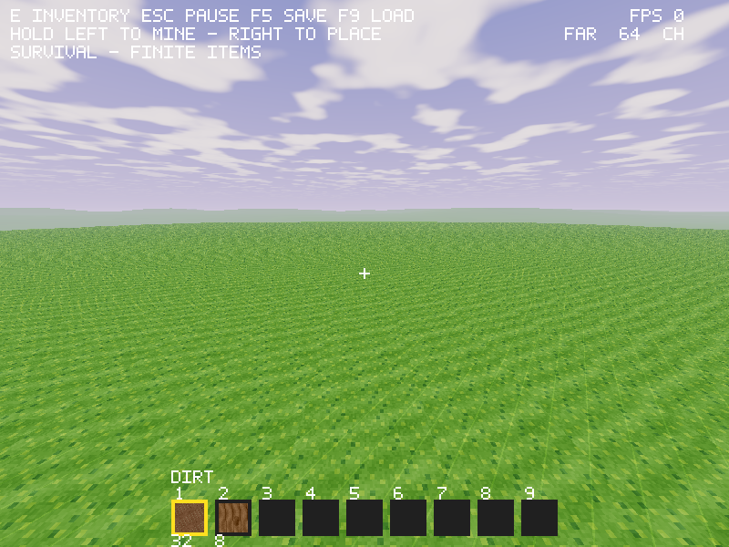
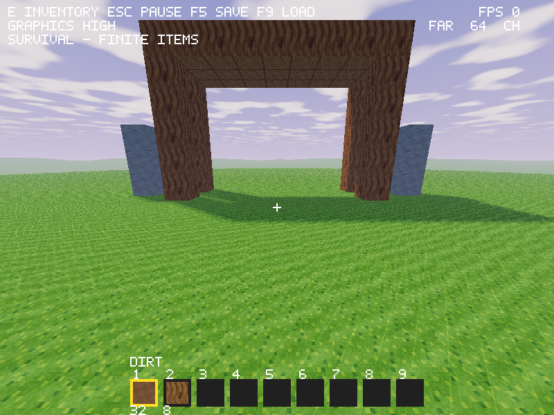
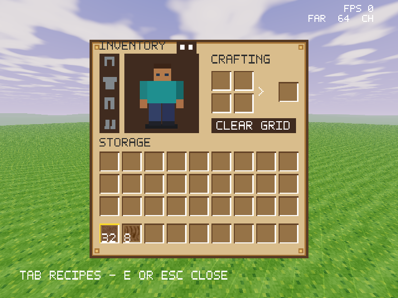
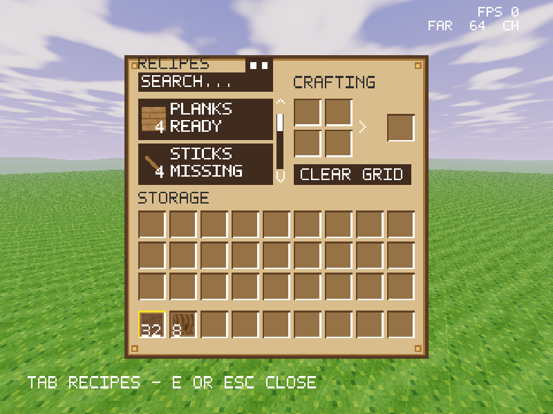

# VoxelA graphics direction

This is the user's agreed visual standard for future graphical work. The old
simple appearance is superseded. All art remains original.

## Art direction

Use stylized fantasy with softer material palettes, **very vibrant** daytime
colors, dramatic landscapes and dreamlike glowing environments. Build block
materials and item icons as 64×64 pixel art with readable silhouettes, coherent
large features and fine grain. Keep most world/creature geometry block shaped.
Clouds and water should tend toward realistic soft cloud forms and reflective
water, within this fantasy palette.

Menus use warm rustic panels, parchment, dark wood wells, brass edging and
restrained decoration. Preserve inventory slot readability and interaction
geometry while changing its appearance. The player should remain recognizable
as an original block character with a slightly rounded appearance. Add a live
animated 3D inventory preview and a later wardrobe for shirt/pants changes;
the current pixel preview is only a placeholder for that work.

Very dark nights/caves should be balanced by torch light, including a held light
that follows the player, and adjustable brightness/visibility aids. Head bob,
motion blur, depth of field and screen shake should eventually default on, each
with an independent disable switch. Those effects are not yet implemented.

## Priority and completion

The user's first priorities are soft shadows, clouds and water reflections,
followed by sunsets and stars. Ambient occlusion, fog, bloom and waving foliage
also belong in the plan. README is the canonical completion checklist.

Implemented in the current renderer:

- Original 1,024×64 RGBA atlas: sixteen 64×64 tiles, with cutout leaves/tools,
  soil/mineral grain, bark, timber end rings, planks and table/chest art.
- Directional warm sunlight and colored sky ambient fill. Fragment derivatives
  recover face normals; lighting is calculated in linear color, then uses a
  bounded filmic shoulder and display conversion. UI icons/text stay unlit.
- Lavender/blue sky gradient, warm analytic sun disk/halo, soft procedural clouds
  and matching distance haze. The sky ray uses the same FOV/yaw/pitch as terrain.
- A real depth-only 1,024² sun shadow framebuffer. Cutout alpha also applies to
  the shadow pass. Balanced uses four depth comparisons and High uses nine for
  filtered shadow edges. Static sun depth is cached and invalidated on mesh rebuilds,
  including streaming/edit/load changes, rather than rerendered every frame. Bias reduces self-shadow artifacts; samples beyond the
  map receive sunlight. These are filtered raster shadows, not ray tracing.
- Parchment/brown inventory, brass trim/corner inlays and warm storage wells,
  preserving all inventory/book hit positions and ownership rules.
- F6 cycles Low, Balanced and High. **High is the default.** Low skips the shadow
  pass/clouds/haze, Balanced uses fewer cloud layers and shadow taps, High uses
  the complete current effect set. Presets remain session-local.

The cloud layer/sun are static. There is no simulation clock-driven sunset or
night yet. Soft filtered edges do not imply physically variable penumbra size.
The shadow volume currently covers the resident prototype around Y72, with
64/96/160-block light-space half extents. Tall terrain, moving sunlight and far
rendering require new dynamic/cascaded coverage. The current terrain/cache still
has its previously documented limits; the graphics revamp does not add biomes,
water blocks, caves or creatures.

Next implement water geometry/simulation and reflective shading, then connect
sun/sky/cloud motion, sunsets and stars to persisted time. Follow with true
occlusion, bloom/postprocess infrastructure, foliage motion, held/local lights
and the character/effect controls. Keep less expensive presets available and
measure performance before claims about supported hardware or smooth FPS.

## GPU ownership and verification

NASM owns the shader program, three geometry buffer pairs, atlas texture,
shadow depth texture and framebuffer. Initialization checks shader/link status
and framebuffer completeness. Draw restores the default framebuffer, viewport,
active atlas unit and depth testing before world/UI passes. Idempotent shutdown
deletes the extra resources along with existing resources.

`make material-assets-test` rebuilds art in an isolated directory and compares
tracked outputs, PNG CRCs/orientation, dimensions, opacity/cutouts and font bounds.
`play-reference` uses a real OpenGL context: checks preset sky pixels, invalid
preset rejection, inventory conservation, rendered shadow depth and raised gateway occluders, restored GL
state and the complete existing gameplay/menu/save suite. `window-reference`
sends actual F6 key events alongside its gameplay script. Debug/release Linux
checks and Windows cross-builds are required; native Windows graphics remains a
separate verification step.

Distant terrain follows [the actual-terrain LOD contract](landscape-and-distance.md);
it must use the current world generator and saved surfaces at every detail level.
Experimental terrain styles require adopting the same generator in block chunks
before they can change the horizon.
