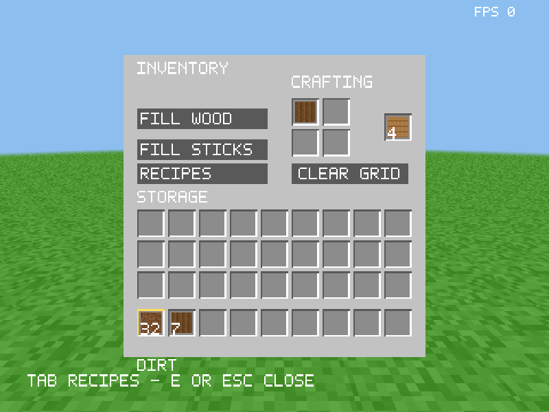

# Inventory, crafting and controls milestone

**Later requirement:** the user subsequently requested dropping player-grid
ingredients onto the ground when the inventory closes. The retained-grid behavior
described here remains the current implementation until physical drops are ready.
See [confirmed design decisions](game-design-decisions.md).

This session implements these 28 observable behaviors in the assembly game:

1. A compact centered inventory with three storage rows above a separated hotbar.
2. A real four-cell 2×2 crafting grid in the player inventory.
3. One wood in any grid cell produces four planks.
4. Two vertically aligned planks in either grid column produce four sticks.
5. A live result preview that leaves ingredients unchanged.
6. Clicking a valid result consumes one batch and creates its output.
7. Compatible results merge into the held stack, with a maximum of64.
8. Shift-clicking the result repeatedly crafts into carried inventory.
9. Left-click pickup, place, merge and swap in grid cells.
10. Right-click half-stack pickup and single-item placement in grid cells.
11. Drag placement between carried inventory and crafting cells.
12. Shift-clicking a grid cell returns its ingredients to carried inventory.
13. A **Fill Wood** button arranges the wood recipe using owned ingredients.
14. A **Fill Sticks** button arranges the vertical stick recipe.
15. A **Clear Grid** button returns all ingredients transactionally.
16. Backspace performs the same clear-grid action while the menu is open.
17. A clickable **Recipes** button opens the existing recipe browser.
18. Double-click gathers matching resources from carried slots and the grid
    into the held stack. Tools remain individual records.
19. Hovered slots receive a light highlight.
20. Hovered items show a name tooltip that stays within the virtual canvas.
21. Keys1–9 swap the hovered carried slot with the corresponding hotbar slot.
22. Mouse wheel cycles the hotbar in both directions, wrapping at its ends.
23. Middle-click in Creative selects the aimed buildable block from the palette.
24. The inventory scales uniformly instead of stretching with window aspect.
25. Centered pointer mapping ignores the letterboxed areas and slot gaps.
26. Grid ingredients remain owned by the player when the inventory closes.
27. Gameplay format4 saves the complete grid; formats1/2/3 migrate with an empty
    grid while retaining their supported carried/cursor contents and tool wear.
28. FPS remains visible and continues updating while the inventory is open.

## Transaction and ownership rules

The player owns one grid, independent of menu visibility. There is no temporary
output item until a result is taken. Preview checks exact ingredient positions,
including extra occupied cells. Only registered valid Slot8 records are accepted.

Taking a result into an incompatible/full cursor is a no-op. Crafting into a
full bag is a no-op for that batch. Repeated crafting stops at the first failed
batch or exhausted recipe, with a hard limit of64 batches. Each successful
batch commits output and ingredient consumption together.

Autofill first stages returning the current grid into the bag, then takes the
new recipe's ingredients. Missing ingredients or insufficient return capacity
leave the original state unchanged. Clear Grid similarly returns all cells or
none. Shift-returning a single cell is atomic; it does not discard a remainder.
Cursor-held items are not counted as autofill ingredients.

Closing still attempts to return the cursor to carried inventory. If the bag is
full, the menu remains open with its cursor intact. Grid contents stay in their
cells across closing; E makes them available again. Changing mode does not
consume grid/cursor contents; Survival crafting requires ingredients and is
disabled in Creative.

## Wire format and APIs

`CraftState336` contains the unchanged `Inventory304` followed by four row-major
Slot8 records at304/312/320/328: top-left, top-right, bottom-left, bottom-right.
`play_get_inventory` still writes exactly304 bytes. The new `play_get_crafting`
writes exactly32 bytes. The existing legacy inventory and save APIs remain.

`craft_valid`, `craft_preview`, `craft_click`, `craft_clear`, `craft_fill`,
`craft_take`, `craft_repeat`, `craft_collect` and `inventory36_swap` implement the
CPU rules. Preview returns a complete output Slot8, zero for no recipe, or−1
for invalid state. Transactions return1 changed,0 unavailable/no-op,−1 invalid;
repeat returns the successful batch count or−1 invalid. Click accepts cell0–3
and action0 left/1 right/2 Shift; fill accepts recipe0 wood/1 sticks; take accepts
destination0 cursor/1 carried. Swap accepts carried0–35 and hotbar0–8.

`game_grid_encode/decode` use the same four-argument contracts as `game36_*`.
Format4 has Header128, Edit32 records, then CraftState336. Header96 is336;
payload length is `count*32+336`; total length is `464+count*32`, capped at
**262,608 bytes** for8192 edits. Generator0 and registry1 are unchanged. The
checksum covers every byte with checksum bytes40–47 treated as zero. Invalid
metadata, grid records, pose or edits reject before live state changes. Inputs
remain immutable. Legacy decode commits an empty new grid only after success.

`inventory_ui_position/slot` share slot geometry: storage X160+36×column at
Y204/168/132, hotbar atY88, with32-pixel slots. Grid positions are X340/376 at
Y334/298; output X448,Y316. The recipe page retains its existing56-pixel hotbar
and recipe controls. The640×480 canvas fits uniformly in drawable dimensions;
SDL coordinates use logical dimensions through the same scale/centering math.

## Validation and limits

The new CPU suites pass18,775 assertions per ABI/configuration:7920 crafting,
9042 geometry/pointer, and1813 save/migration checks. Full existing CPU suites,
real graphics/input checks, filesystem and packaging tests also pass.

Independent tests cover all625 four-cell combinations from a representative
item set, translated recipes, malformed states, tool wear, full destinations,
autofill rollback, result capacity, repeated output, and3000 randomized
conservation interactions. Geometry tests check every slot edge and gap,
random hit coordinates, wide/tall window mapping, and output canaries. Codec
tests cover exact wire bytes, every-byte corruption, repaired invalid metadata,
maximum journals and legacy1/2/3 migration. These run under System V and the
Microsoft x64 test adapter and are configured for native Windows CI.

Real OpenGL checks exercise grid controls, output creation, blocked output,
repeated crafting, menu/grid persistence, hover rendering, number swaps, wheel
wrapping, Creative picking and menu FPS. The real SDL executable script also
exercises autofill and Backspace before its existing recipe/mining/save flow.
Debug/release Windows executables cross-build locally; native Windows graphics
execution is not established by those builds or the Linux ABI adapter.

Craftable/placeable tables and table-owned 3×3 grids remain pending. Tool recipes
still use the existing ingredient-required bulk recipe browser and shortcuts;
they are not yet table-gated. This milestone does not add terrain, creatures,
health, hunger, flight, or larger render distance.

