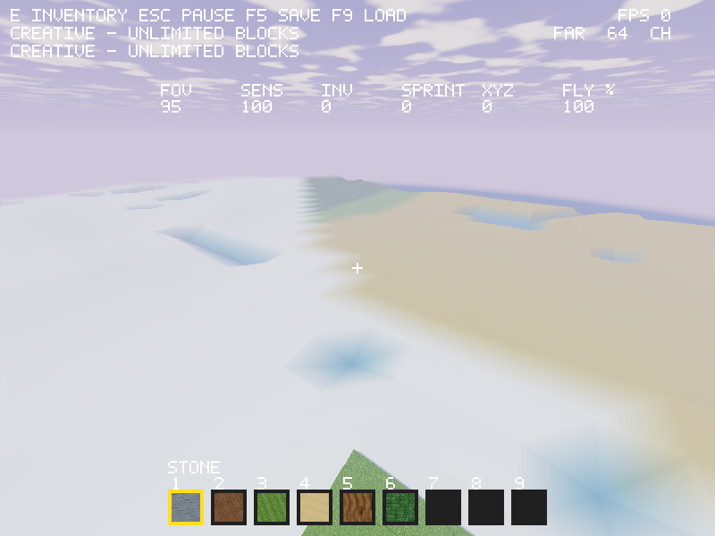

# Biome landscape and distant terrain

The playable renderer now draws a bounded simplified heightfield out to a
configurable 2–256 chunk radius (32–4,096 blocks). The default is 64 chunks.
The HUD shows FAR and the current chunk radius. F7 halves the far radius; F8 doubles it, clamping at the bounds. These are
session-local visual settings. The fog and projection range follow the radius.

The full-detail, collision/edit/picking cache remains five columns across.
Distant geometry is a **visual preview**, not loaded or explorable block chunks.
It cannot be mined and does not imply the requested 16-chunk full-detail radius
is implemented. Frozen generator0, existing save files and edits remain intact.

`landscape_sample(seed,x,z,out16)` is an independent NASM sampler with integer
Q16 climate noise. It writes surface height, biome ID, moisture and temperature.
It rejects horizontal coordinates outside ±30 million before touching output.
The 11 biome profiles are plains, forest, desert, mountains, ocean basins, river
corridors, tundra, swamp, savanna, crystal highlands and ash mountains. Heights
currently span roughly 24–243; the future 1,024-block block-world range, caves,
vegetation, water/liquid simulation and measured rare-biome frequencies are
still pending. Ocean/river colors denote basin profiles, not reflective water.

The distant mesh uses 65×65 sample points and 64×64 cells: 24,576 vertices,
about 0.75 MiB of uploaded geometry and 0.13 MiB scratch samples. Work and storage
stay bounded when radius increases; larger radii use coarser cells. Sampling
uses global integer world coordinates and camera-relative float vertices, even
millions of blocks from origin. Biome colors interpolate across triangles.
A 48–160-block transition blends toward legacy surface heights near the loaded
cache, offset downward to avoid fighting the detailed surface. Fragment clipping keeps
the coarse mesh out of the full-detail cache footprint. The preview
ignores edits outside the detailed cache; this is not saved chunk border blending.

Mesh rebuilds invalidate the preview; radius changes also rebuild it. Generation
and upload remain synchronous, so there can be loading hitches. Streaming jobs,
adaptive LOD rings, frustum selection and preserving distant saved terrain are
next requirements before treating this as the final far renderer. Existing
sun shadows cover the detailed region; outside that volume distant terrain
receives directional/ambient light without mapped shadows.

The independent Python model tests seed/climate/height rules, all 11 biomes,
signed coordinates, boundaries and output canaries through both ABIs. OpenGL
checks cover radius bounds, rendering differences, unchanged item ownership,
large-coordinate save/rebase restart and existing gameplay. Windows native
CPU checks run in CI; local Windows renderer checks are cross-builds.

